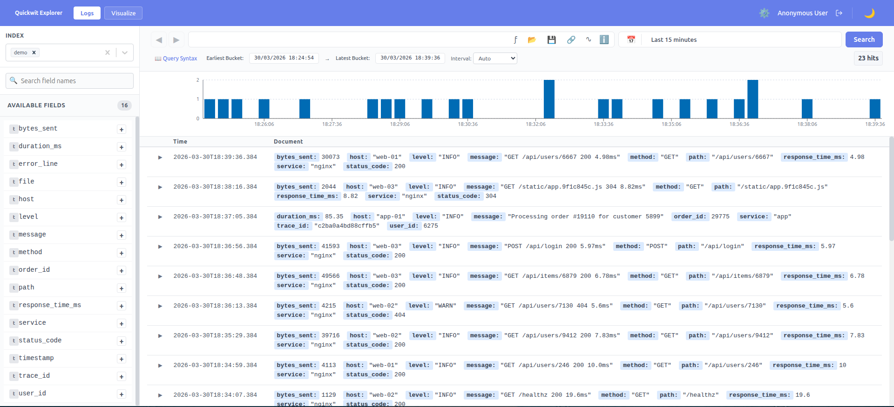
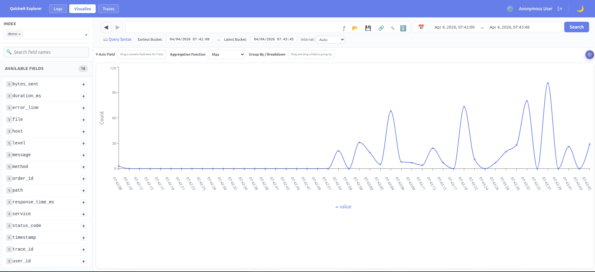
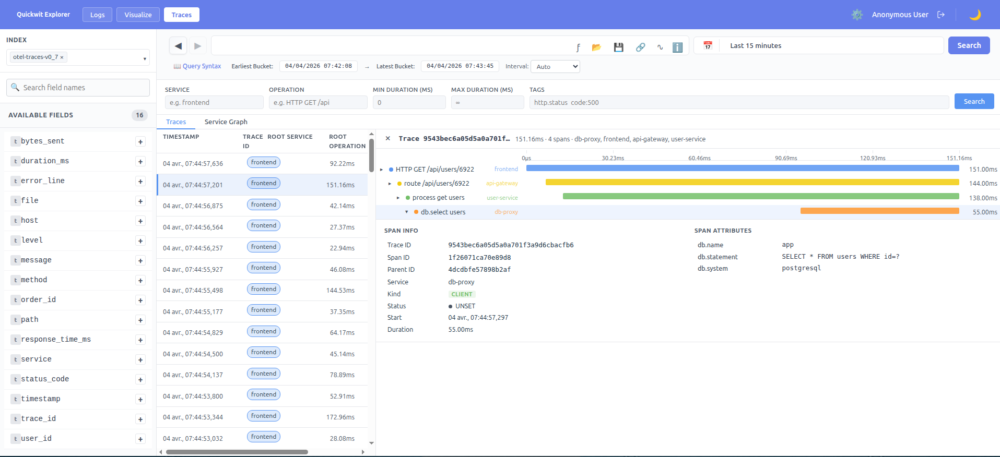

# qwui

<a href="qwui-1.png"></a>
<a href="qwui-2.png"></a>
<a href="qwui-3.png"></a>

A Kibana-like log explorer UI for [Quickwit](https://quickwit.io). React frontend, choice of Go or Rust backend.

## Architecture

```
Browser
  └── Vite dev server (port 5173) or built static files
        └── /api/*       → qwui backend (port 8080)
        └── /quickwit/*  → qwui backend (port 8080)
              └── proxies to Quickwit (port 7280)
```

The backend handles auth, CSV export, log pattern detection (Drain algorithm), and proxies all Quickwit API calls.

## Project structure

```
qwui/
├── frontend/          # React + Vite app
│   ├── src/
│   └── public/
├── go-backend/        # Go backend
│   └── pattern/       # standalone Drain algorithm test tool
├── rust-backend/      # Rust backend (includes VRL support)
├── dev/               # Docker data generator (Python)
├── k6/                # Load tests
├── Dockerfile.go      # Builds frontend + Go backend into one image
├── Dockerfile.rust    # Builds frontend + Rust backend into one image
├── docker-compose.yml
└── Makefile
```

## Development

### Prerequisites

- Docker + Docker Compose
- Node.js 20+
- Go 1.24+ **or** Rust 1.75+

### Option 1 — Local backend, Quickwit in Docker

Start Quickwit and the data generator:

```bash
make dev
```

Then run whichever backend you want locally:

```bash
make run-go    # cd go-backend && go run .
make run-rust  # cd rust-backend && cargo run
```

Then start the frontend:

```bash
cd frontend && npm install && npm run dev
# or: make run-frontend
```

Open http://localhost:5173

### Option 2 — Go backend in Docker

```bash
make dev-go
make run-frontend
```

### Option 3 — Rust backend in Docker

```bash
make dev-rust
make run-frontend
```

### Stopping

```bash
make down      # stop all containers and wipe data volumes
```

### Logs

```bash
make logs                              # all services
docker compose logs -f data-generator # generator only
docker compose logs -f qwui-go        # Go backend
docker compose logs -f qwui-rust      # Rust backend
```

## Docker Compose services

| Service | Profile | Description |
|---------|---------|-------------|
| `quickwit` | _(always)_ | Quickwit search engine on port 7280 |
| `data-generator` | _(always)_ | Continuously ingests sample logs into the `demo` index |
| `qwui-go` | `go` | Go backend on port 8080 |
| `qwui-rust` | `rust` | Rust backend on port 8080 |

`qwui-go` and `qwui-rust` both bind port 8080 — only one can run at a time.

## Sample data

The data generator runs continuously in two phases:

1. **Backfill** — 50 000 events spread over the last 7 days, ingested on startup
2. **Stream** — randomised bursts of events with current timestamps, runs forever

Three log types are generated so log pattern detection returns distinct clusters:

- `nginx` — HTTP access logs (method, path, status, response time)
- `app` — Application logs (logins, orders, cache misses, slow queries)
- `php` — PHP errors and warnings with file/line

The index is named `demo` with `timestamp` as the timestamp field.

## Features

### Search toolbar buttons

| Button | Description |
|--------|-------------|
| **Search** | Runs the query. If the time range end is "now" (relative range), it is recomputed to the current time before executing. |
| **↑ / ↓ arrows** | Navigate query history. Previous queries are stored in `localStorage` (up to 50 entries) and restored with their filters, time range, and VRL script. |
| **Save** | Saves the current query (search text, filters, time range, columns) into the `qwui` Quickwit index. |
| **Load** | Lists queries previously saved in the `qwui` index. |
| **Share** | Copies a URL to the clipboard encoding the full query state. Opening the URL restores the exact search. |
| **∿ Patterns** | Analyses log patterns using the Drain algorithm. Samples events across time buckets, clusters them by similarity, and shows the top patterns with their percentage. A field selector lets you run the analysis on a specific field. |
| **ƒ VRL** | _(Rust backend only)_ Opens a VRL (Vector Remap Language) script editor. The script is applied server-side to each result document before it is returned, allowing field extraction, renaming, or computed fields. |
| **Export** | Exports the current search results as a gzip-compressed CSV file, generated by the backend. |

### Saved queries — `qwui` index

Save and Load require a Quickwit index named `qwui` (configurable via `VITE_SAVED_QUERIES_INDEX`). Create it once:

```bash
curl -X POST http://localhost:7280/api/v1/indexes \
  -H 'Content-Type: application/yaml' \
  --data-binary @- <<'EOF'
version: 0.8
index_id: qwui
doc_mapping:
  timestamp_field: timestamp
  field_mappings:
    - name: timestamp
      type: datetime
      fast: true
      input_formats: [rfc3339]
      output_format: rfc3339
    - name: type
      type: text
      tokenizer: raw
    - name: name
      type: text
    - name: query
      type: json
      stored: true
search_settings:
  default_search_fields: [name, type]
EOF
```

### VRL — Rust backend only

The VRL button is only shown when the backend reports `features.vrl: true` in `/api/auth/status`. This is only the case with the Rust backend, which embeds the VRL runtime. The Go backend silently ignores any `vrl` field and always reports `features.vrl: false`.

Example VRL script:

```coffee
# Parse a JSON string field into structured fields
. = parse_json!(.raw_message)
.level = upcase(.level)
```

The execution time is shown next to the button after each search.

### Multi-index search

Select multiple indexes from the index dropdown. Indexes are searchable together only if they share the **same timestamp field** — indexes with a different timestamp field are shown as disabled with a tooltip explaining why.

When multiple indexes are selected:
- Histogram is disabled (field may not exist across all indexes)
- `sort_by` is disabled for the same reason
- Quickwit's native comma-separated index URL format is used internally (`/api/v1/index1,index2/search`)

### Log pattern detection

Click **∿** to cluster the visible logs using the Drain algorithm:

- The time range is split into 20 equal buckets, 500 events are sampled per bucket in parallel (10 000 events total), avoiding Quickwit's `start_offset > 10 000` limit
- Tokens that look like IDs (IPs, UUIDs, hex strings, numbers, tokens longer than 40 characters) are normalised to `<*>`
- Similar log lines are merged into a cluster; the similarity threshold is 0.4
- Results show the template with `<*>` wildcards highlighted in orange, and the percentage of logs matching each pattern
- Each pattern has a **Show sample** toggle to display an example log line
- A field selector lets you run the analysis on a specific field instead of the full document

### Popular fields

Fields you frequently expand or add as columns are tracked per-index in `localStorage` under `fieldPopularity`. The top 10 most-used fields are shown in a **Popular** section at the top of the fields sidebar, above the full alphabetical list. A popular field is removed from the main list to avoid duplication. The section is hidden when empty.

Popularity is incremented when you click the **+** column button (not when expanding for top values).

### User settings

Accessed via the **⚙** gear icon. Stored in `localStorage` under `userPreferences`.

| Setting | Description |
|---------|-------------|
| Default tab | Whether documents open in **Table** or **JSON** view by default |
| Font size | Result table font size in pixels |
| JSON collapsed | Whether JSON view starts collapsed |
| Display data types | Show data type annotations in JSON view |
| Display object size | Show object/array size in JSON view |

Dark mode is toggled with the **☀/☾** button and stored separately in `localStorage` under `darkMode`.

### Visualize mode

Switch between **Logs** and **Visualize** using the buttons in the top bar.

In Visualize mode a **GraphView** panel replaces the results table. You can:

- Drag a numeric field from the sidebar onto the Y-axis
- Choose the aggregation (count, sum, avg, min, max)
- Choose the chart type (bar, line)
- The X-axis is always time; the histogram interval follows the global interval selector

Only numeric fields are accepted on the Y-axis — float fields are validated via a `stats` aggregation; text/keyword fields are rejected with an error message.

## Environment variables

| Variable | Default | Description |
|----------|---------|-------------|
| `QUICKWIT_URL` | `http://localhost:7280` | Quickwit base URL |
| `PORT` | `8080` | Backend listen port |
| `VITE_SAVED_QUERIES_INDEX` | `qwui` | Quickwit index used to store saved queries |
| `OIDC_ENABLED` | `false` | Enable OIDC authentication |
| `OIDC_CLIENT_ID` | — | OIDC client ID |
| `OIDC_SECRET` | — | OIDC client secret |
| `OIDC_ISSUER` | — | OIDC issuer URL |
| `OIDC_REDIRECT` | — | OIDC redirect URL |
| `SESSION_SECRET` | — | Cookie session secret |

## Helm

A Helm chart is available under [helm/qwui/](helm/qwui/).

### Install

```bash
helm repo add qwui https://gitarns.github.io/qwui
helm repo update
helm install qwui qwui/qwui \
  --set quickwit.url=http://quickwit:7280
```

### Use the Rust backend image

```bash
helm install qwui qwui/qwui \
  --set image.repository=ghcr.io/gitarns/qwui-rust \
  --set quickwit.url=http://quickwit:7280
```

### Enable ingress

```bash
helm install qwui qwui/qwui \
  --set quickwit.url=http://quickwit:7280 \
  --set ingress.enabled=true \
  --set ingress.className=nginx \
  --set "ingress.hosts[0].host=qwui.example.com" \
  --set "ingress.hosts[0].paths[0].path=/" \
  --set "ingress.hosts[0].paths[0].pathType=Prefix"
```

### Key values

| Value | Default | Description |
|-------|---------|-------------|
| `image.repository` | `ghcr.io/gitarns/qwui-go` | Image to use (`qwui-go` or `qwui-rust`) |
| `image.tag` | chart `appVersion` | Image tag |
| `quickwit.url` | `http://quickwit:7280` | Quickwit base URL |
| `replicaCount` | `1` | Number of replicas |
| `ingress.enabled` | `false` | Enable ingress |
| `extraEnv` | `[]` | Extra environment variables |

## Building for production

```bash
# Go backend
docker build -f Dockerfile.go -t qwui:go .

# Rust backend
docker build -f Dockerfile.rust -t qwui:rust .
```
